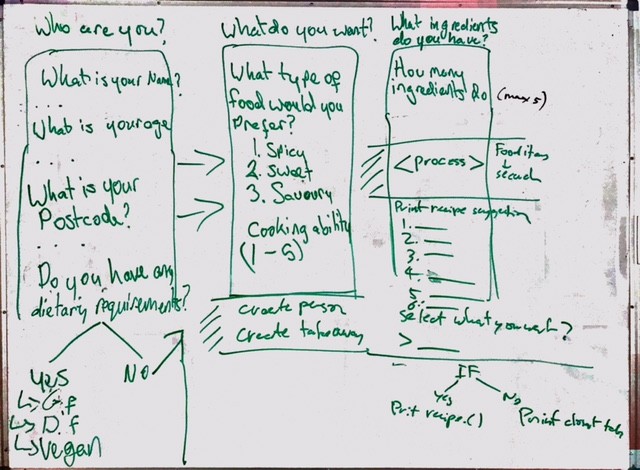

# CFA-Recipe-Finder-App

## About CFA-Recipe-Finder-App  
  With some easy questions, this application will support you to decide your meal and show its recipe. 
  The recipe finder app takes input from a user depending on what ingredients they have in their cupboard and then uses a     google API to search for recipes which include those ingredients.
  If you have any allergies then we are able to tailor the search results based around your food rqeuirements and preferred     food tastes.
  (reference: All recipes are pulled using the food2fork API which gives you access to a socially ranked recipe database and which includes ingredient search function.

## Features
  *	Utilises Google search to be able to search the internet for recipes based on the input from the user.
  *	This program uses the Nokogiri gem to skim html code and pull the relevant information out from a website.
  *	Different Ruby Gems like Sanitize and display tables allows the app to format the html code and strip/recondition it so that it is user friendly output.
  *	The main final output will produce a recipe which includes the ingredients and the method to make the recipe. On top of this, the app provides the user possible restaurants in their area and reviews of those restaurants if they would prefer to eat out instead.


### Installation instruction
* Install following gems :    
```
gem 'terminal-table'  
gem 'paint'  
gem 'Geocoder'  
gem 'nokogiri'  
gem 'open-uri'  
gem 'open_uri_redirections'  
gem 'rest-client'  
gem 'food2fork'  
gem 'html_to_plain_text'  
 ```  
* Run above gems in Ruby :  
```
require 'terminal-table'  
require 'paint'  
require 'Geocoder'  
require 'nokogiri'  
require 'open-uri'  
require 'open_uri_redirections'  
require 'rest-client'  
require 'food2fork'  
require 'html_to_plain_text'  
```  

### Usage instructions

* Clone files from Git with the following information:   
  
 `git clone https://github.com/ethankhoa/CFA-Recipe-Finder-App.git`
  
  
  User must acquire own Google Token and input it into credentials.rb file
  
  

* Open up directory that the files are downloaded to and run:

`   $ruby recipe_finder_app.rb  `

  
 * For example :  
  Step 1  
  *create users questioner
  *call method to start questions

  Step 2  
  *create cook based on users answers

  Step 3  
  *create new Google Places client  
  *create places search based on user input  
  *pull user coordinates based on postcode  
  *return recipe based on users ingredients  
  *gets and returns list of restaurants in the area  
  *gets and returns one random restaurant near the user  
 
   `$ruby projects.rb`
```
require './question_class'  
require './cook_class'  
require './takeaway_class'  
require './food2fork'  
require './credentials'  
require 'Paint'  
  
questions_new = {  
  #question hash for asking all the questions.  
  question_1: "What is your name?",  
  question_2: "What is your age?",  
  question_3: "What is your postcode",  
  question_4: "Do you have any dietery requirements?  
    1. Yes  
    2. No",  
 ```  
 ```
  answers_new = {  
  #answers for all the questions stored in an empty hash  
  :answers_1 => "",  
  :answers_2 => "",  
  :answers_3 => "",  
  :answers_4 => "",      
```

```
user_1 = Questioner.new(questions_new, answers_new)  
cook_1 = Cook.new(user_1.answers[:answers_1], user_1.answers[:answers_5])  
  
  
client = GooglePlaces::Client.new(get_google_credentials)  
  
  
client = GooglePlaces::Client.new(get_google_credentials)  
  
  
cook_1_search = PlacesSearch.new(client, cook_1.postcode, cook_1.taste_preference)  
  
client_coordinates = cook_1_search.get_client_coordinates(cook_1.postcode)  
  
  
puts recipe_1 = get_recipe(user_1.ingredients)  
  
  
new_results = cook_1_search.get_spots(client, client_coordinates)  
cook_1_search.place_search_details(new_results)  
  
  
new_single_place = cook_1_search.single_place_search_details(new_results)  
```  

## Design Journey/Process  
  Please refer to the following web site.  
https://trello.com/b/MyQUz6GK/team-terminal-app-ethan-josh-surya-taka

### Document how your team designed your app  
  ## Design Journey/Process  
  Please refer to the following web site.  
https://trello.com/b/MyQUz6GK/team-terminal-app-ethan-josh-surya-taka

### Document how your team designed your app  

Original idea concepts:

- Executive assistant
- Surf app
- Recipe/Restaurant finder App

We chose the Recipe Finder App because there is the ability to develop a lot of functionality with room to add extra functionality down the road once we have done more market research.

The design process involved a number of variables to take into account, this included using the barebone requirements that anyone requires when researching food as well as including some cool functionality which gives the user a reason to be using our app. The hardest thing was trying to trim it down so that we could complete our first version and then look to build on the concept further. Some other ideas that we had were:

- Being able to order food directly to you through an ubereats or menu log API.
- Ordering any ingredients that you don't from supermarket chain.
- Making a reservation with the restaurant that you decide to go to if you don't want to eat.

There was a lot of time spent understanding how the data would be pulled from the sites and then re-formatted in a readable state for the users. The Google search API's also required a lot of time to trim down the information, be able to pull the right information and display it back to the user in an easy to read manner. Ideally, in a perfect world we would spend more time understanding the customer and how they rank importance of information then look at modifying the output to optimise their expeirience.

Our app flow stayed the same most of the way with a few areas where we had to reduce overall functionality as they would be considered more sprinkles than doughnuts. In saying that each input we receive from the user in this version is able to be used across multiple functions taking into account their preferences, their location and the resources they have available to them. As our information base of these profiles increases we will be able to optimise their future experiences through offering more accurate suggestions. Further to this, we are able to re-use this information for new functionality as the app continues to build.

